# Evidencias de EC2, S3, RDS y CloudWatch

## 1. Objetivo

Documentar con evidencias visuales la implementación de los servicios de cómputo, almacenamiento, base de datos y monitoreo para el proyecto WordPress en AWS — Comercial Nova.

## 2. Amazon RDS (MySQL)

### Configuración implementada

| Parámetro | Valor |
|---|---|
| Identificador | rds-wordpress-comercial-nova |
| Motor | MySQL Community |
| Clase de instancia | db.t3.micro |
| Base de datos | wordpressdb |
| Usuario | adminwp |
| Zona de disponibilidad | us-east-1b |
| Acceso público | No |
| Backups automáticos | Habilitado (7 días) |
| DB Subnet Group | db-subnet-wordpress-comercial-nova |
| Endpoint | rds-wordpress-comercial-nova.cuh9d2ijmqfs.us-east-1.rds.amazonaws.com |

### Evidencias

| Captura | Descripción |
|---|---|
| 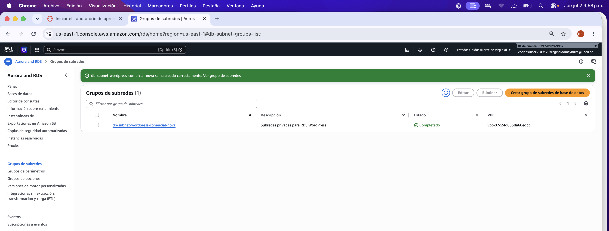 | Grupo de subredes en VPC privada |
| 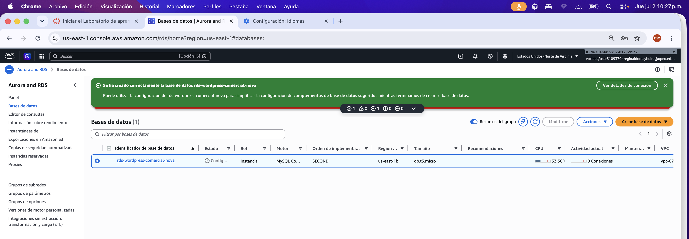 | Configuración de backups automáticos |
| 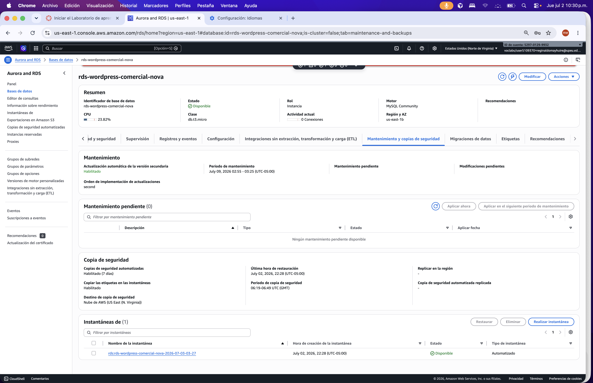 | Instancia RDS en estado Disponible |

## 3. Amazon S3

### Configuración implementada

| Parámetro | Valor |
|---|---|
| Nombre del bucket | s3-comercial-nova-wordpress-dan |
| Región | us-east-1 |
| Bloqueo de acceso público | Activado |
| Versionado | Activado |
| Archivo de prueba | Cargado |

### Evidencias

| Captura | Descripción |
|---|---|
| 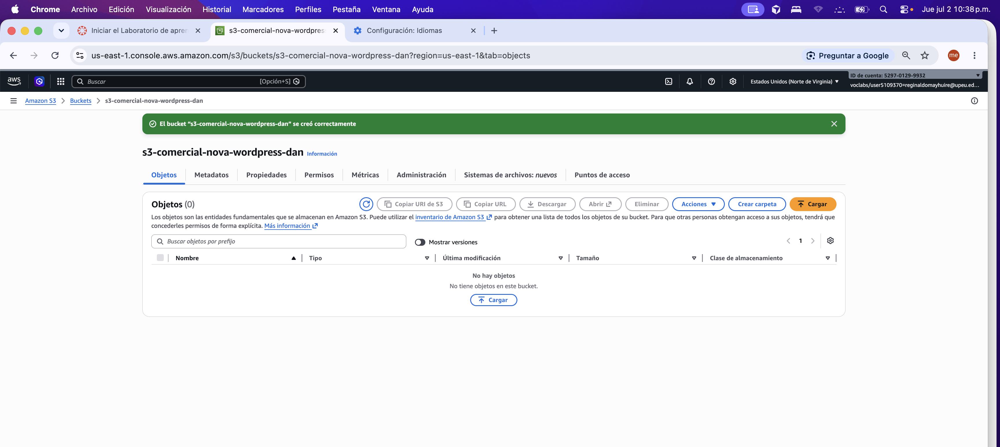 | Bucket creado correctamente |
| 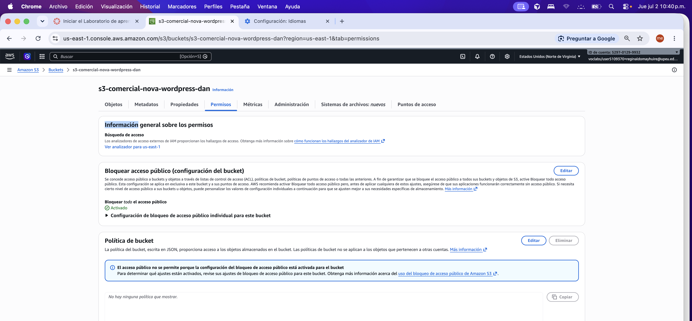 | Bloqueo de acceso público activado |
| 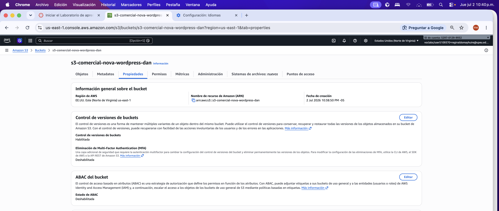 | Versionado habilitado |
| 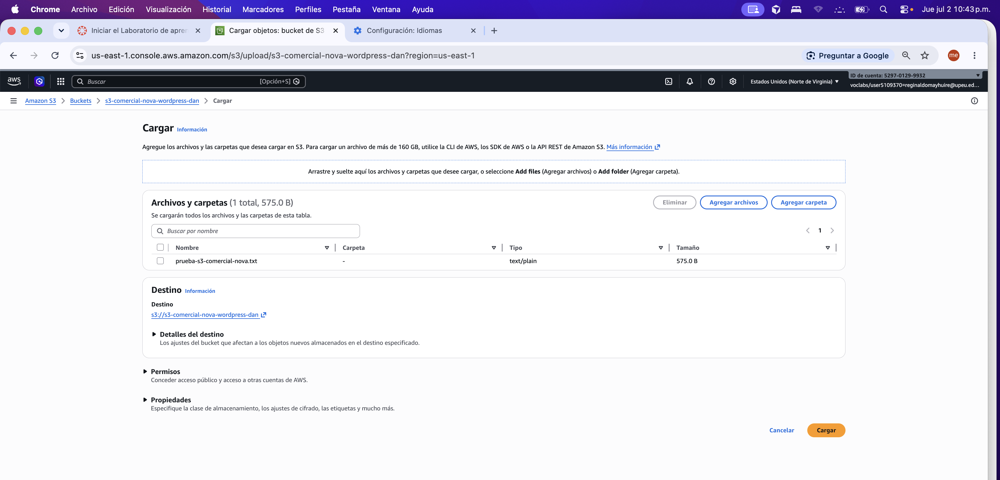 | Archivo de prueba cargado |

## 4. Amazon EC2

### Configuración implementada

| Parámetro | ec2-wordpress-1a | ec2-wordpress-1b |
|---|---|---|
| ID de instancia | i-056e8e4ef10e4173d | i-0d1322dbfcfaef7fc |
| Tipo | t2.micro | t2.micro |
| SO | Amazon Linux 2023 | Amazon Linux 2023 |
| Zona | us-east-1a | us-east-1b |
| Subred | subnet-publica-1a | subnet-publica-1b |
| Estado | running (2/2 checks) | running (2/2 checks) |
| Software | Apache, PHP, WordPress | Apache, PHP, WordPress |
| Security Group | ec2-wordpress-comercial-nova | ec2-wordpress-comercial-nova |

### Evidencias

| Captura | Descripción |
|---|---|
| 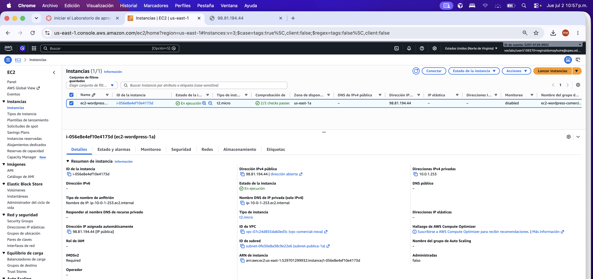 | Instancia ec2-wordpress-1a en ejecución |
| 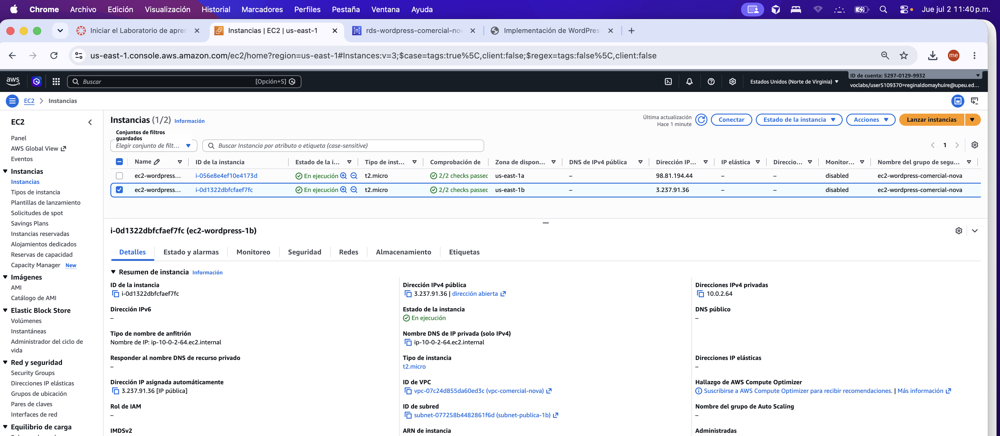 | Instancia ec2-wordpress-1b en ejecución |
| 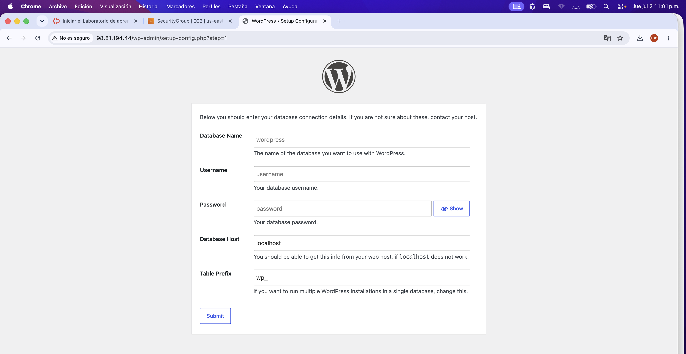 | Pantalla de configuración de base de datos |
| 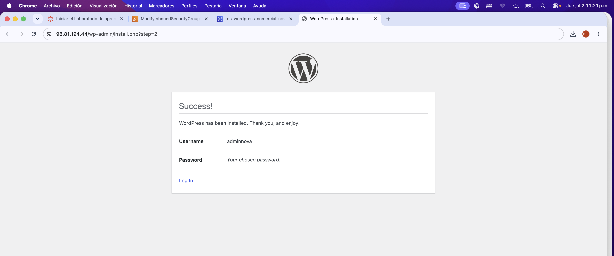 | Instalación de WordPress completada |
| 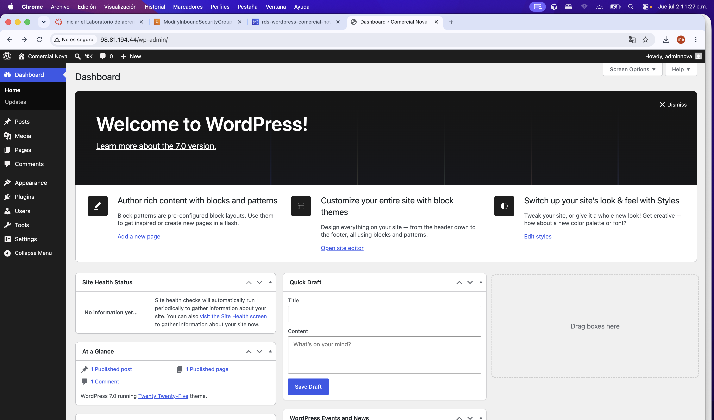 | Panel de administración funcionando |
| 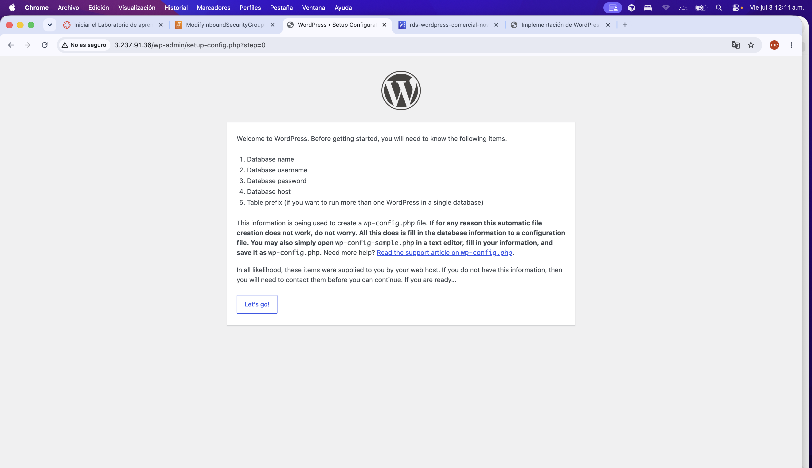 | Segunda instancia conectada al mismo RDS |

## 5. Application Load Balancer y Target Group

| Parámetro | Valor |
|---|---|
| ALB | alb-comercial-nova |
| DNS | alb-comercial-nova-1298470052.us-east-1.elb.amazonaws.com |
| Target Group | tg-wordpress-comercial-nova |
| Protocolo | HTTP:80 |
| Targets | 2 healthy |

### Evidencias

| Captura | Descripción |
|---|---|
| 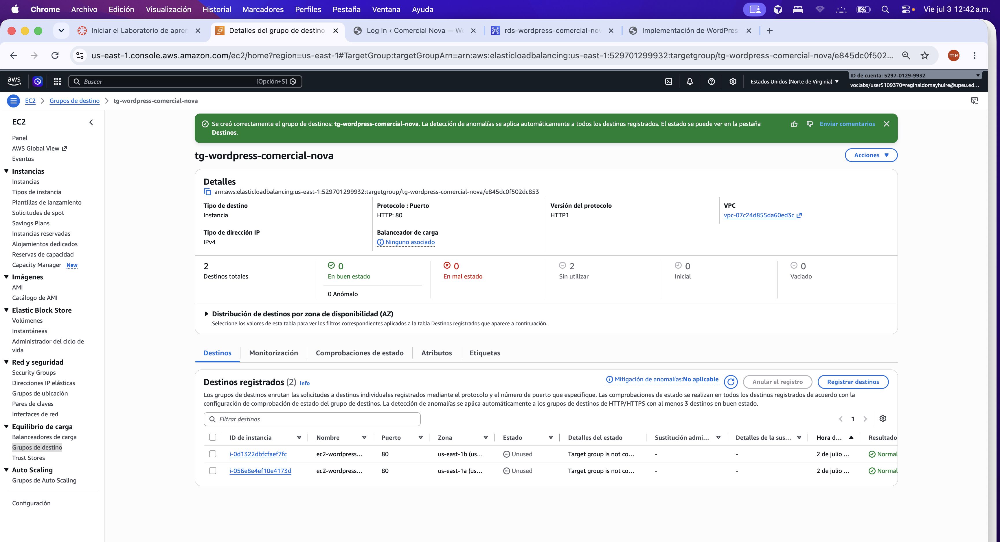 | Target Group con 2 instancias registradas |
| 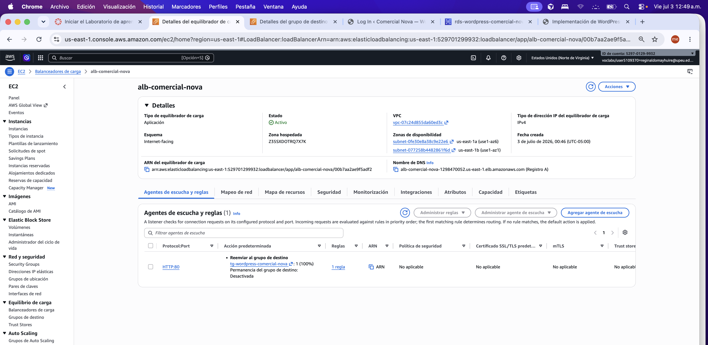 | Application Load Balancer activo |
| 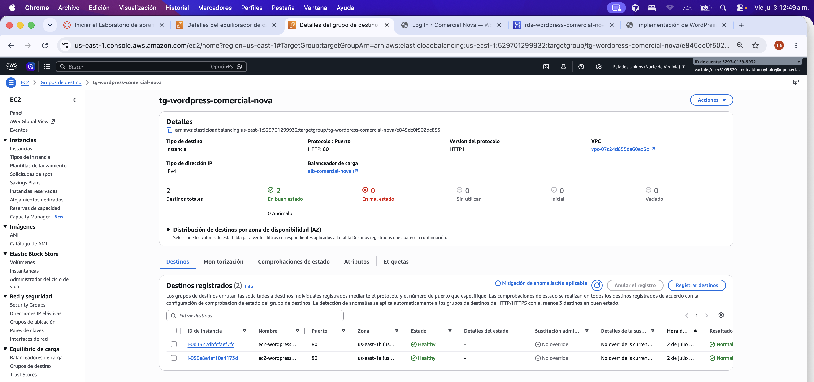 | Ambos targets en estado healthy |
| 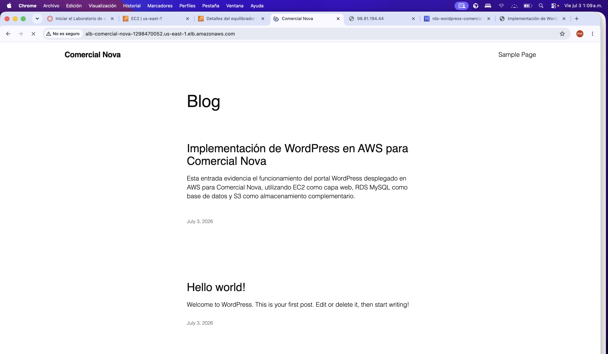 | Sitio accesible vía Load Balancer |

## 6. Auto Scaling

| Parámetro | Valor |
|---|---|
| Launch Template | lt-wordpress-comercial-nova (lt-059d92a19e60e2cba) |
| Auto Scaling Group | asg-wordpress-comercial-nova |
| Capacidad deseada | 2 |
| Mínimo | 1 |
| Máximo | 3 |
| Política | CPU promedio objetivo 70 % |
| Target Group asociado | tg-wordpress-comercial-nova |

### Evidencias

| Captura | Descripción |
|---|---|
| 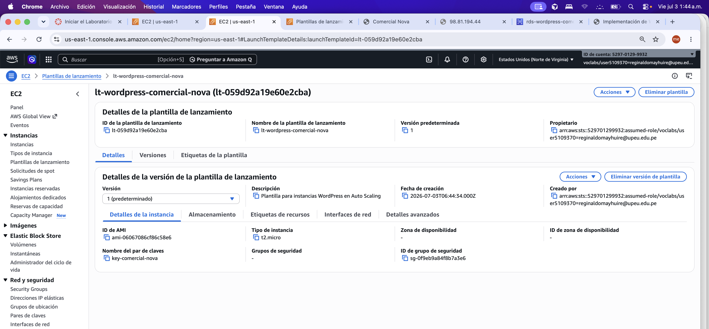 | Plantilla de lanzamiento configurada |
| 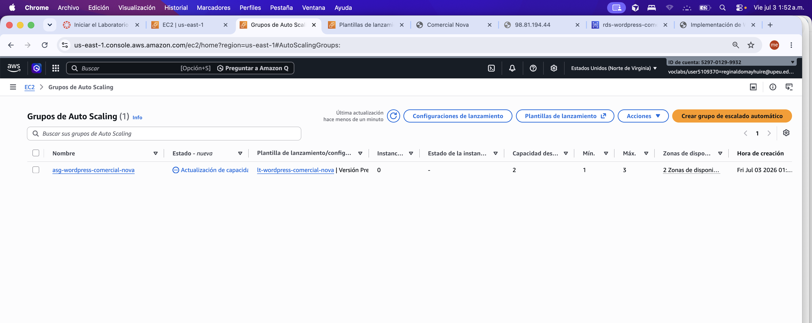 | Auto Scaling Group creado |
| 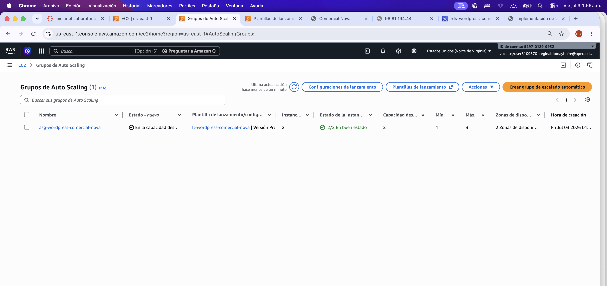 | 2/2 instancias en buen estado |
| 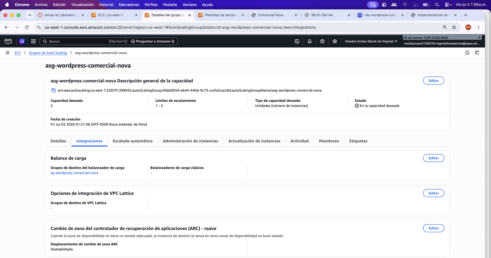 | Integración con Target Group |

## 7. Amazon CloudWatch

| Parámetro | Valor |
|---|---|
| Dashboard | dashboard-comercial-nova |
| Métricas EC2 | CPUUtilization (i-056e8e4ef10e4173d, i-0d1322dbfcfaef7fc) |
| Métricas RDS | CPUUtilization, DatabaseConnections, FreeStorageSpace |
| Alarma | alarma-cpu-ec2-wordpress |
| Umbral | CPU > 70 % |

### Evidencias

| Captura | Descripción |
|---|---|
|  | Dashboard con métricas EC2 y RDS |
|  | Alarma de CPU creada |

## 8. Limitaciones AWS Academy

- Cost Explorer muestra 0,00 USD; no refleja costos reales del laboratorio.
- RDS en Single-AZ por control de costos en AWS Academy.

## 9. Lecciones aprendidas

- Verificar que ambas instancias EC2 apunten al mismo endpoint RDS antes de completar la instalación de WordPress.
- El health check del Target Group confirma que la capa web responde correctamente antes de asociar el ALB.
- CloudWatch permite correlacionar métricas de EC2 y RDS en un solo dashboard para diagnóstico rápido.
- Auto Scaling requiere que la Launch Template incluya la misma configuración de seguridad y AMI que las instancias originales.
