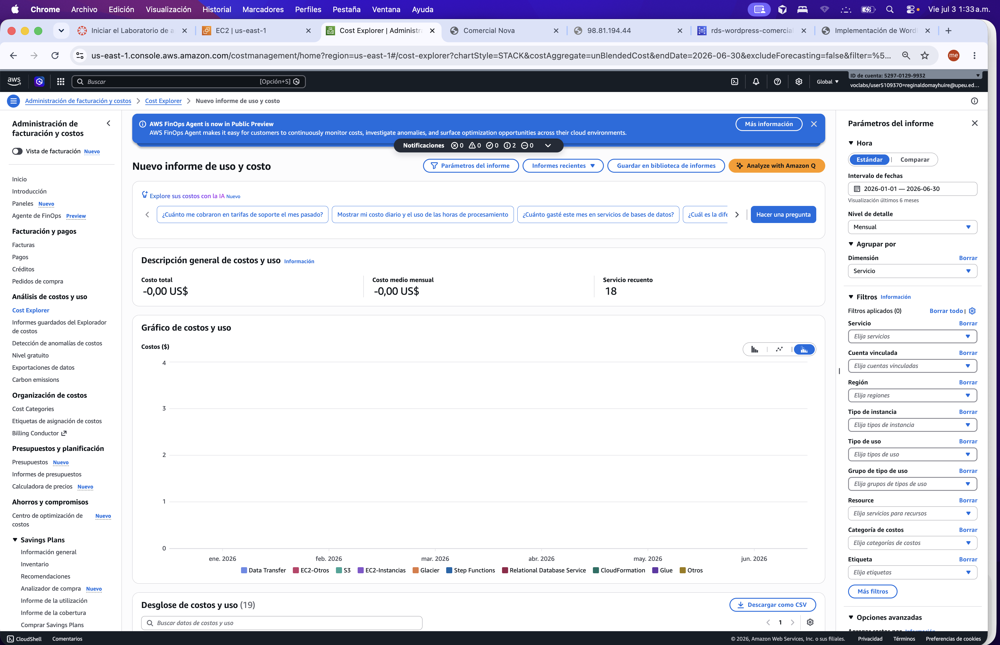

# Optimización de Costos

## 1. Objetivo

Analizar los costos de la arquitectura WordPress en AWS — Comercial Nova y proponer acciones de optimización, considerando las limitaciones del entorno AWS Academy.

## 2. Evidencia de Cost Explorer

En el entorno AWS Academy, **Cost Explorer reporta 0,00 USD** para el período analizado (enero–junio 2026). Esto se debe a que el laboratorio académico no factura al estudiante.

*Figura 1: Cost Explorer con costo total ~0,00 USD en AWS Academy.*

A pesar de ello, el gráfico identifica los servicios activos en la cuenta: EC2, RDS, S3, Data Transfer, entre otros.

## 3. Estimación mensual referencial

Dado que Cost Explorer no refleja costos reales en el laboratorio, se presenta una estimación referencial académica basada en componentes desplegados. Los valores son aproximados y no representan facturación real:

| Componente | Configuración | Costo referencial mensual aprox. (USD) |
|---|---|---|
| EC2 | 2 × t2.micro (Linux) | ~16 – 20 |
| RDS | db.t3.micro, Single-AZ, 20 GB | ~15 – 18 |
| Application Load Balancer | 1 ALB + LCU mínimas | ~16 – 22 |
| S3 | < 1 GB, versionado activo | ~< 1 |
| CloudWatch | 1 dashboard, 1 alarma | ~< 3 |
| Transferencia de datos | Tráfico de laboratorio | ~< 5 |
| **Total referencial** | | **~50 – 70** |

## 4. Componentes de mayor costo

En una arquitectura similar en producción, los mayores costos provendrían de:

1. **Application Load Balancer** — costo fijo mensual independiente del tráfico.
2. **Amazon EC2** — dos instancias en ejecución continua.
3. **Amazon RDS** — instancia administrada con almacenamiento y backups.

## 5. Acciones de optimización implementadas

| Acción | Servicio | Impacto |
|---|---|---|
| Rightsizing EC2 (t2.micro) | EC2 | Reduce costo de cómputo al mínimo funcional |
| RDS Single-AZ (db.t3.micro) | RDS | Evita el doble costo de Multi-AZ |
| Bloqueo público en S3 | S3 | Evita cargos por transferencia no autorizada |
| Auto Scaling (Min 1, Max 3) | EC2 | Permite reducir instancias en períodos de baja demanda |
| Backups RDS limitados a 7 días | RDS | Balance entre recuperación y almacenamiento |

## 6. Acciones de optimización recomendadas

| # | Acción | Servicio | Ahorro esperado |
|---|---|---|---|
| 1 | Apagar o terminar recursos al finalizar el laboratorio | EC2, RDS, ALB | Alto — evita costos fuera de sesión |
| 2 | Configurar políticas de ciclo de vida en S3 (transición a Glacier/IA) | S3 | Medio — para datos de respaldo antiguos |
| 3 | Ajustar almacenamiento RDS al mínimo necesario | RDS | Bajo–medio — evita sobreaprovisionamiento |
| 4 | Usar Reserved Instances o Savings Plans en producción | EC2, RDS | Alto — con compromiso a 1–3 años |
| 5 | Revisar métricas de Auto Scaling para evitar sobreescalado | EC2 | Medio — ajustar umbral de CPU |

## 7. Comparación: arquitectura inicial vs optimizada

| Aspecto | Arquitectura inicial (propuesta) | Arquitectura optimizada (implementada) |
|---|---|---|
| EC2 | 2 × instancia sin tipo definido | 2 × t2.micro con Auto Scaling (1–3) |
| RDS | MySQL sin restricción de AZ | db.t3.micro Single-AZ, backups 7 días |
| S3 | Bucket sin políticas | Bloqueo público + versionado |
| Balanceo | ALB propuesto | ALB activo con health checks |
| Monitoreo | CloudWatch básico | Dashboard + alarma CPU 70 % |
| Costo referencial aprox. | ~70–90 USD/mes | ~50–70 USD/mes |

## 8. Limitaciones AWS Academy

- Cost Explorer muestra **0,00 USD** y no permite validar estimaciones con datos reales de facturación.
- El presupuesto del laboratorio limita el uso de instancias más grandes o servicios adicionales.
- La sesión de laboratorio tiene duración finita; los costos reales solo aplicarían si los recursos permanecieran activos fuera del entorno académico.
- Single-AZ en RDS fue una decisión consciente de control de costos, no una limitación técnica.

## 9. Lecciones aprendidas

- En AWS Academy, la estimación manual de costos es indispensable porque Cost Explorer no refleja gastos reales.
- El ALB tiene un costo fijo significativo; en proyectos de bajo tráfico, evaluar si un único EC2 con IP elástica sería suficiente.
- Auto Scaling con mínimo de 1 instancia permite ahorrar si la demanda es intermitente.
- Documentar las decisiones de optimización junto con su justificación demuestra comprensión del trade-off costo/disponibilidad.
