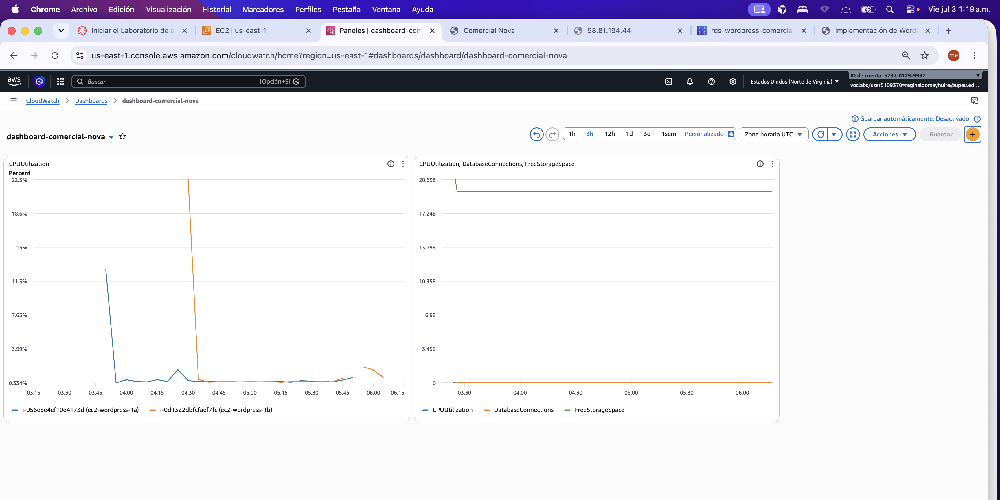
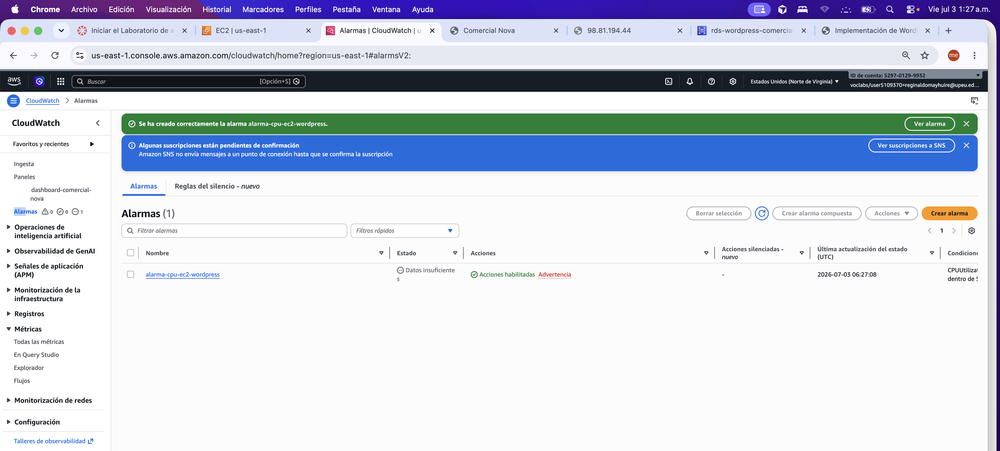

# Alertas y Monitoreo Configurados

## 1. Objetivo

Documentar la configuración de monitoreo operacional mediante Amazon CloudWatch para la arquitectura WordPress en AWS — Comercial Nova.

## 2. Dashboard CloudWatch

| Parámetro | Valor |
|---|---|
| Nombre | dashboard-comercial-nova |
| Región | us-east-1 |
| Widgets | CPU EC2, CPU RDS, conexiones de BD, almacenamiento libre |

### Métricas monitoreadas

| Métrica | Recurso | Namespace |
|---|---|---|
| CPUUtilization | i-056e8e4ef10e4173d (ec2-wordpress-1a) | AWS/EC2 |
| CPUUtilization | i-0d1322dbfcfaef7fc (ec2-wordpress-1b) | AWS/EC2 |
| CPUUtilization | rds-wordpress-comercial-nova | AWS/RDS |
| DatabaseConnections | rds-wordpress-comercial-nova | AWS/RDS |
| FreeStorageSpace | rds-wordpress-comercial-nova | AWS/RDS |

### Evidencia

*Figura 1: Dashboard `dashboard-comercial-nova` con métricas de EC2 y RDS.*

## 3. Alarma configurada

| Parámetro | Valor |
|---|---|
| Nombre | alarma-cpu-ec2-wordpress |
| Métrica | CPUUtilization |
| Namespace | AWS/EC2 |
| Umbral | > 70 % |
| Período de evaluación | Pendiente de completar |
| Acción | Notificación SNS (suscripción pendiente de confirmación) |
| Estado inicial | Datos insuficientes (normal en alarma recién creada) |

### Evidencia

*Figura 2: Alarma `alarma-cpu-ec2-wordpress` creada correctamente.*

## 4. Relación con Auto Scaling

La política de escalado del Auto Scaling Group (`asg-wordpress-comercial-nova`) utiliza un objetivo de **CPU promedio del 70 %**, alineado con el umbral de la alarma de CloudWatch. Esto permite que el sistema reaccione automáticamente ante picos de carga.

| Recurso | Configuración |
|---|---|
| Auto Scaling Group | asg-wordpress-comercial-nova |
| Política de escalado | Target tracking — CPU promedio 70 % |
| Capacidad | Desired 2, Min 1, Max 3 |

## 5. Alarmas recomendadas (no implementadas)

| Alarma sugerida | Métrica | Umbral sugerido | Justificación |
|---|---|---|---|
| CPU alta RDS | CPUUtilization (RDS) | > 80 % | Detectar sobrecarga en base de datos |
| Almacenamiento bajo RDS | FreeStorageSpace | < 2 GB | Prevenir pérdida de datos |
| Targets unhealthy ALB | UnHealthyHostCount | ≥ 1 | Detectar fallos en instancias EC2 |

## 6. Limitaciones AWS Academy

- Las suscripciones SNS requieren confirmación manual; la alarma existe pero las notificaciones no se envían hasta confirmar el endpoint.
- El monitoreo detallado de EC2 (1 minuto) puede tener costo adicional en producción; en el laboratorio se usa monitoreo básico.
- Algunas métricas avanzadas de RDS no están disponibles en instancias db.t3.micro.

## 7. Lecciones aprendidas

- Un dashboard centralizado facilita la correlación entre carga de EC2 y comportamiento de RDS.
- Configurar la alarma con el mismo umbral que la política de Auto Scaling mantiene coherencia operacional.
- Confirmar las suscripciones SNS es un paso frecuentemente omitido; sin él, las alarmas no notifican.
- El estado "Datos insuficientes" es normal inmediatamente después de crear una alarma; se resuelve al acumular métricas.
