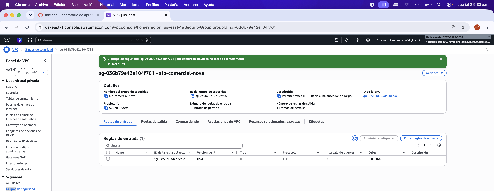
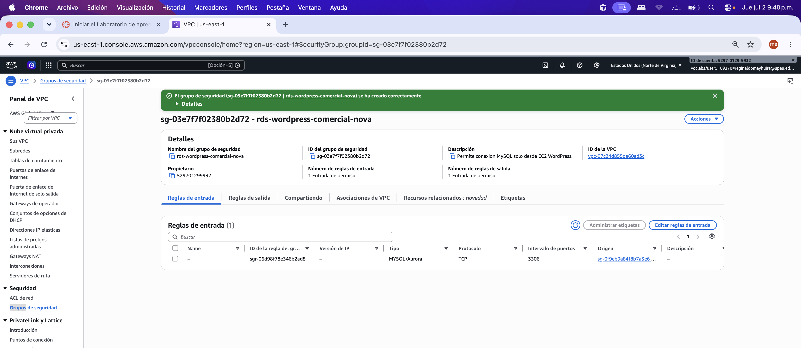

# Matriz de Accesos y Seguridad

## 1. Objetivo

Documentar los accesos configurados en la arquitectura WordPress en AWS — Comercial Nova, aplicando el principio de mínimo privilegio.

## 2. Security Groups

| Security Group | ID | Recurso asociado | Puerto | Protocolo | Origen permitido | Justificación |
|---|---|---|---:|---|---|---|
| alb-comercial-nova | sg-036b79e42e104f761 | Application Load Balancer | 80 | TCP | 0.0.0.0/0 | Permitir acceso público HTTP al sitio WordPress |
| ec2-wordpress-comercial-nova | sg-0f9eb9a84f8b7a3e6 | Instancias EC2 WordPress | 80 | TCP | sg-036b79e42e104f761 (ALB) | Configuración final recomendada: tráfico web solo desde el balanceador |
| ec2-wordpress-comercial-nova | sg-0f9eb9a84f8b7a3e6 | Instancias EC2 WordPress | 80 | TCP | 0.0.0.0/0 | Temporal (pruebas): acceso directo por IP pública para validación |
| ec2-wordpress-comercial-nova | sg-0f9eb9a84f8b7a3e6 | Instancias EC2 WordPress | 22 | TCP | 190.233.3.74/32 | Permitir administración SSH restringida al estudiante |
| rds-wordpress-comercial-nova | sg-03e7f7f02380b2d72 | Base de datos RDS | 3306 | TCP | sg-0f9eb9a84f8b7a3e6 (EC2) | Permitir conexión MySQL solo desde WordPress |

### Evidencias

| Captura | Descripción |
|---|---|
|  | Security Group del ALB |
|  | Security Group de EC2 |
|  | Security Group de RDS |

## 3. Modelo de capas de seguridad

```text
Internet (0.0.0.0/0)
    │ HTTP:80
    ▼
[SG: alb-comercial-nova]
    │ HTTP:80
    ▼
[SG: ec2-wordpress-comercial-nova]
    │ MySQL:3306
    ▼
[SG: rds-wordpress-comercial-nova]
    (subred privada, sin acceso público)
```

Cada capa solo acepta tráfico de la capa anterior. RDS no tiene acceso desde Internet.

## 4. Amazon S3

| Parámetro | Valor |
|---|---|
| Bucket | s3-comercial-nova-wordpress-dan |
| Acceso público | Bloqueado |
| Versionado | Activado |
| Acceso | Mediante IAM (no exposición directa) |

**Evidencias:** `evidencias/capturas_servicios/14_s3_bloqueo_publico.png`, `15_s3_versionado_activado.png`

## 5. IAM

| Rol / Usuario | Servicio | Permisos requeridos | Justificación |
|---|---|---|---|
| Usuario estudiante AWS Academy | Consola AWS | Permisos asignados por laboratorio Vocareum | Administración de recursos durante la práctica |
| Rol EC2 WordPress | EC2 / S3 | Acceso limitado a bucket S3 si aplica | Permitir carga o lectura de archivos necesarios |
| Rol CloudWatch | EC2 / RDS / CloudWatch | Lectura de métricas y gestión de alarmas | Monitoreo operacional |
| RDS | RDS | Acceso administrado por Security Group | Base de datos protegida de acceso público |

## 6. Reglas de endurecimiento aplicadas

- No utilizar credenciales root para operaciones diarias.
- Restringir SSH únicamente a la IP del estudiante (190.233.3.74/32).
- RDS sin acceso público; ubicado en subredes privadas.
- Bucket S3 con bloqueo de acceso público activado.
- Security Groups separados para ALB, EC2 y RDS.
- Solo los puertos necesarios están abiertos (80, 22, 3306).
- En configuración final, el tráfico web a EC2 debe quedar restringido únicamente al Security Group del ALB.

> HTTPS/443 no fue configurado en esta implementación académica. Se considera como mejora futura mediante certificado SSL/TLS.

> Durante la etapa de pruebas se habilitó temporalmente HTTP 80 desde `0.0.0.0/0` para validar acceso directo por IP pública. En una configuración final, el acceso HTTP a EC2 debe quedar restringido únicamente al Security Group del ALB.

## 7. Limitaciones AWS Academy

- Los permisos IAM están predefinidos por el laboratorio; no es posible crear políticas personalizadas avanzadas.
- La IP del estudiante para SSH puede cambiar; debe actualizarse en el Security Group si cambia de red.
- HTTPS/443 no fue configurado; el sitio opera únicamente por HTTP/80 a través del ALB.

## 8. Lecciones aprendidas

- Separar Security Groups por capa (ALB → EC2 → RDS) simplifica la auditoría y el mantenimiento.
- Referenciar Security Groups como origen (en lugar de IPs) hace la configuración más portable ante cambios de instancias.
- El bloqueo público en S3 debe activarse al crear el bucket, no como paso posterior.
- Documentar la IP de SSH con evidencia de captura evita ambigüedades en la evaluación.
