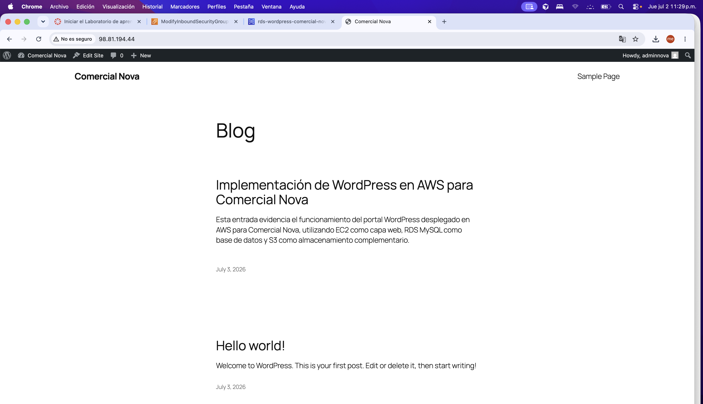
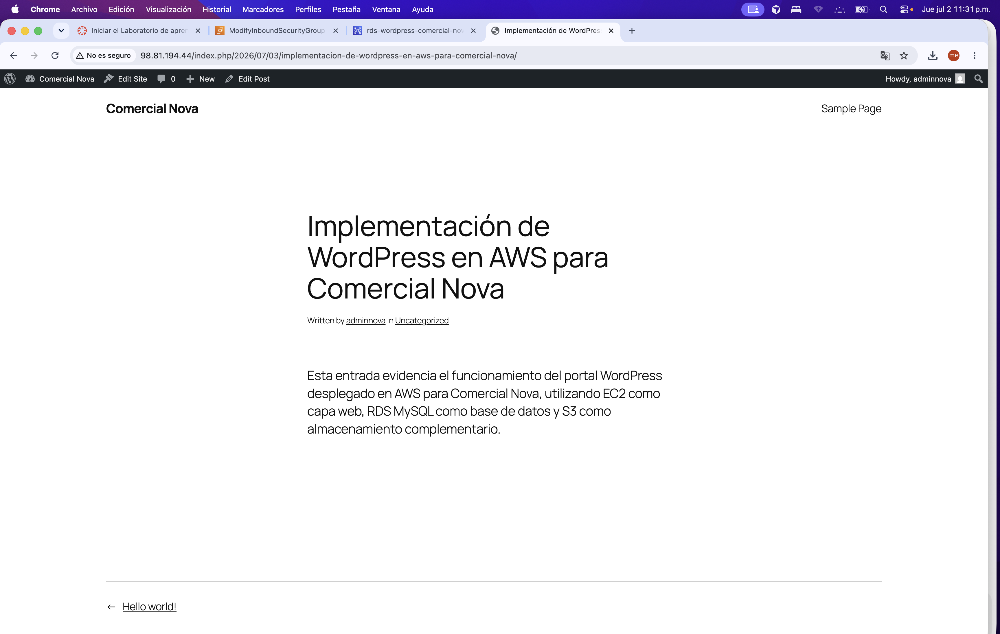

# Evidencia de Publicación de Contenido — WordPress Comercial Nova

## 1. Objetivo

Documentar que el sitio WordPress *Comercial Nova* fue instalado correctamente, que el panel de administración funciona y que se publicó contenido académico que evidencia la integración de los servicios AWS.

## 2. Datos del sitio

| Parámetro | Valor |
|---|---|
| Nombre del sitio | Comercial Nova |
| URL pública (ALB) | http://alb-comercial-nova-1298470052.us-east-1.elb.amazonaws.com |
| Usuario administrador | adminnova |
| Base de datos | wordpressdb (RDS MySQL) |
| Instancias EC2 | ec2-wordpress-1a, ec2-wordpress-1b |
| Almacenamiento complementario | s3-comercial-nova-wordpress-dan |

## 3. Instalación completada

La instalación de WordPress se realizó sobre Amazon Linux 2023 con Apache y PHP. Ambas instancias EC2 se conectaron a la misma base de datos RDS (`rds-wordpress-comercial-nova`).

### Evidencias de instalación

| Captura | Descripción |
|---|---|
|  | Pantalla de configuración de conexión a base de datos |
|  | Instalación de WordPress finalizada |
|  | Panel de administración accesible |

## 4. Sitio público funcionando

El sitio es accesible tanto por IP directa de EC2 como por el Application Load Balancer.

| Captura | Descripción |
|---|---|
|  | Sitio WordPress visible en navegador |
|  | Sitio accesible vía DNS del Load Balancer |

## 5. Entrada publicada

Se publicó una entrada de blog que documenta la arquitectura implementada:

- **Título:** *Implementación de WordPress en AWS para Comercial Nova*
- **Autor:** adminnova
- **Fecha:** 3 de julio de 2026
- **Contenido:** Describe el uso de EC2 como capa web, RDS MySQL como base de datos y S3 como almacenamiento complementario.

También se conserva la entrada por defecto *Hello world!* generada durante la instalación.

### Evidencia

| Captura | Descripción |
|---|---|
|  | Entrada académica publicada y visible en el sitio |

## 6. Segunda instancia EC2 conectada al mismo RDS

La instancia `ec2-wordpress-1b` muestra el mismo sitio WordPress al conectarse al endpoint RDS compartido, confirmando que ambas instancias sirven el mismo contenido.

| Captura | Descripción |
|---|---|
|  | Segunda instancia con el sitio operativo |

## 7. Verificación funcional

| Prueba | Resultado |
|---|---|
| Acceso al sitio vía ALB | Correcto |
| Acceso al panel `/wp-admin` | Correcto |
| Entrada publicada visible | Correcto |
| Ambas EC2 con mismo contenido (RDS compartido) | Correcto |
| Targets del ALB en estado healthy | Correcto |

## 8. Limitaciones AWS Academy

- El sitio opera por HTTP sin certificado SSL/TLS (mejora futura).
- Las IPs públicas de EC2 cambian al reiniciar instancias; el acceso estable es vía DNS del ALB.
- El entorno de laboratorio tiene duración limitada por sesión.

## 9. Lecciones aprendidas

- Completar la instalación de WordPress en la primera instancia antes de replicar la configuración en la segunda reduce errores de conexión a RDS.
- Publicar una entrada con contenido académico facilita demostrar que el sitio es funcional y no solo una instalación por defecto.
- El Load Balancer es el punto de acceso recomendado para evaluación, ya que abstrae las IPs individuales de las instancias.
